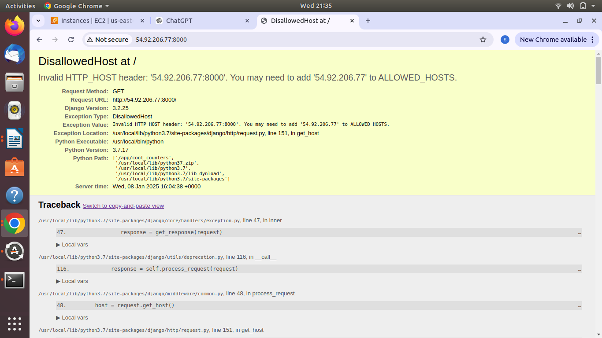
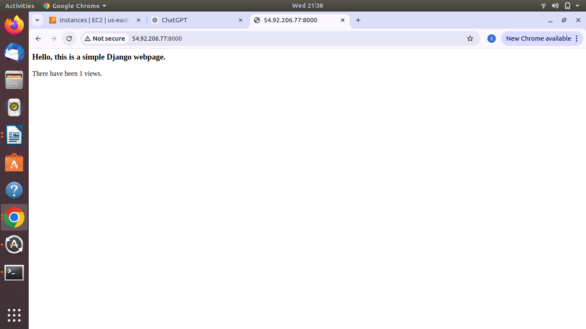

# Simple Django App

This is a simple, minimal Django app intended to help understand the main aspects of working with Django.

---

## Setup Docker

### 1. Install Docker in Your System
Run the following commands to install Docker on your machine:

```bash
sudo apt-get update 
sudo apt-get install docker.io -y
```

Verify the Docker installation:
```bash
docker --version
```

---

### 2. Create a Project Directory
Create a directory for your project and navigate to it:

```bash
mkdir simple-django-app
cd simple-django-app
```

---

### 3. Create a `Dockerfile`
Create a `Dockerfile` to define the image for your Django project:

```bash
vim Dockerfile
```

Add the following content to the `Dockerfile`:

```dockerfile
# Use Python 3.7 as the base image
FROM python:3.7

# Set the working directory inside the container
WORKDIR /app

# Copy all files into the working directory
COPY . .

# Install dependencies from requirements.txt
RUN pip install -r requirements.txt

# Run database migrations
RUN python cool_counters/manage.py migrate

# Start the Django development server
CMD ["python", "cool_counters/manage.py", "runserver", "0.0.0.0:8000"]
```

---

### 4. Build the Docker Image
Use the `docker build` command to create an image for your app:

```bash
docker build -t counter-app .
```

---

### 5. Verify Docker Images
Check the list of Docker images to confirm the build was successful:

```bash
docker images
```

---

### 6. Create and Run a Docker Container
Use the `docker run` command to create and start a container from the image:

```bash
docker run -it -d -p 8000:8000 counter-app:latest
```

This will map port `8000` on your host machine to port `8000` in the container.

---

### 7. Verify Running Containers
Check the status of running containers using:

```bash
docker ps
```

---


Now you can access your Django app in the browser at:  
**http://localhost:8000** or  if you are using AWS EC2 instance you can use their own public ip

# Result:


If you see an HTTP `ALLOWED_HOSTS` error, navigate to the `cool_counters` directory:

```bash
cd cool_counters
```

Then, you can list the contents of the directory to verify:

```bash
ls
```

Update the `settings.py` file to add your host to the `ALLOWED_HOSTS` list.


ALLOWED_HOSTS  ["*"]

# Result



